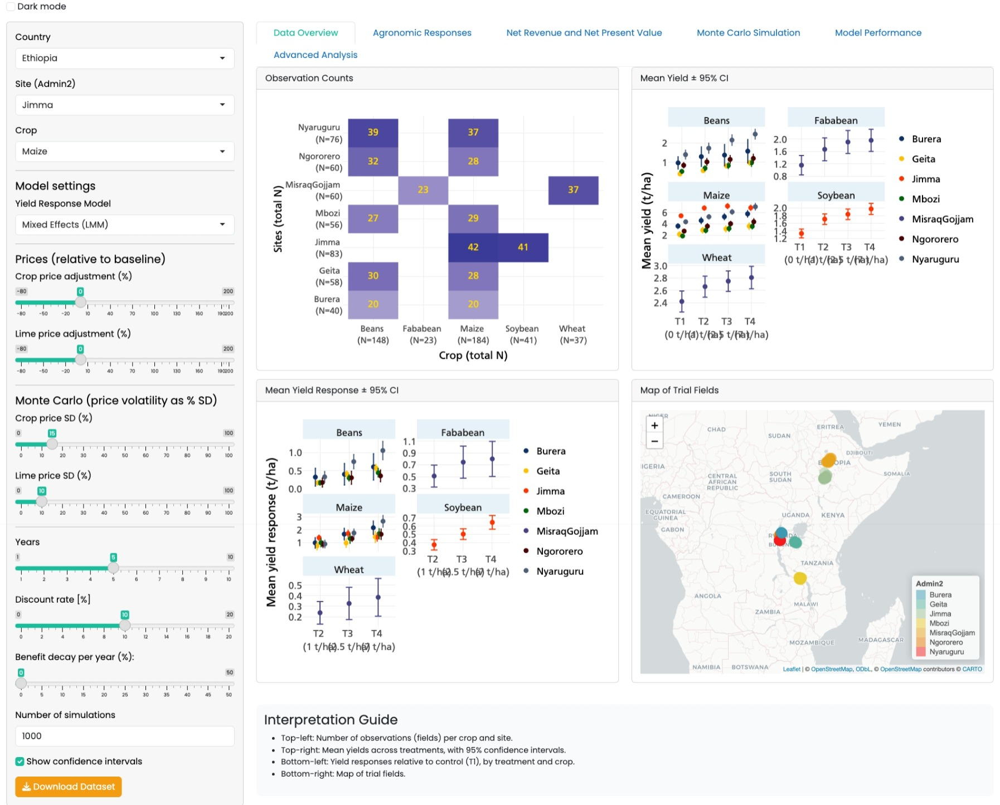

# Lime Profitability Analysis — GAIA Trials (Ethiopia, Rwanda, Tanzania)

An end-to-end, reproducible framework for estimating **crop yield response to an agronomic input** (here: agricultural lime on acid soils) and translating it into **farm-level economics** — first-year profit, multi-year net present value (NPV), break-even prices, probability of profit under price risk, and distributional (quantile) returns.

The repository contains two standalone components:

| Component | What it is | Start here |
|---|---|---|
| [`analysis/`](analysis/) | A numbered R pipeline (`00`–`09`) that goes from raw trial data to publication-ready tables and figures | [`analysis/README.md`](analysis/README.md) |
| [`shiny_app/`](shiny_app/) | An interactive Shiny explorer for the same data: response curves, NPV, Monte Carlo, risk, and adoption scenarios | [`shiny_app/README.md`](shiny_app/README.md) |

Each component runs from its own folder with its own data — you can copy either one out of the repository and it will still work. Although built for the GAIA lime trials, the pipeline is written to be **reused as a template for other input-response profitability studies** (fertilizer, improved seed, irrigation) — see [Adapting this framework](#adapting-this-framework-to-other-studies).

---

## 1. The study in one paragraph

Soil acidity constrains crop production across the East African highlands. The GAIA trials applied four lime rates — 0 (control), 1, 2.5, and 7 t/ha — on farmer fields in Ethiopia, Rwanda, and Tanzania, measuring yields for maize, beans, wheat, soybean, and faba bean (~1,700 year-1 observations across 13 sites). This analysis fits a **crop-level yield response function** to lime (a linear mixed model pooling all sites, with soil and rainfall covariates absorbing site heterogeneity), then asks the economic questions that matter for farmers and policy: *At what lime rate is profit maximized? How long until liming pays back? How robust is profitability to crop and lime prices? Which fields should be targeted first?*

## 2. Repository structure

```
├── analysis/                      # Component 1 — reproducible research pipeline
│   ├── 00_prepare_data.R          # raw Stata file → year-1 analysis dataset
│   ├── 01_extract_rainfall.R      # add rainfall covariate from raster (GPS extraction)
│   ├── 02_variable_selection.R    # covariate screening: NZV → LASSO-CV → VIF
│   ├── 03_response_functions.R    # mixed-model yield response curves per crop
│   ├── 04_profitability.R         # year-1 profit, 4-year NPV, optimal lime rate
│   ├── 05_sensitivity.R           # profitability vs crop-to-lime price ratio
│   ├── 06_prob_profit.R           # Monte Carlo probability of profit
│   ├── 07_model_performance.R     # R², ICC, variance decomposition, diagnostics
│   ├── 08_additional_analysis.R   # BCR, ROI, IRR, pH targeting, price ceiling
│   ├── 09_quantile_lmm.R          # quantile (Q20/Q50/Q80) response and returns
│   ├── R/helpers_econ.R           # pure economic functions (pv_factor, discount_factor)
│   ├── data/                      # raw/ (trial data, rainfall raster), prices/, derived files
│   └── outputs/                   # all generated tables (CSV) and figures (PNG)
│
├── shiny_app/                     # Component 2 — interactive explorer
│   ├── app.R                      # entry point: shiny::runApp()
│   ├── R/                         # globals (data load), UI, server, economic helpers
│   ├── data/                      # model bundle + trial data + base prices (self-contained)
│   ├── data_prep/                 # build_model_bundle.R — regenerates the model bundle
│   └── docs/                      # methodology notes rendered inside the app
│
└── archive/                       # superseded first-generation analysis (kept for history)
```

## 3. Data

**Trial data** — `analysis/data/raw/gaia_trials_all_countries_combined.dta`: field-level GAIA trial records. The variables the pipeline relies on:

| Variable | Meaning |
|---|---|
| `fid` | farmer field ID (the experimental unit) |
| `country`, `admin2_gadm` | country and district/site |
| `lat`, `lng` | field GPS coordinates |
| `crop` | Maize, Beans, Wheat, Soybean, Fababean |
| `treatment`, `lime_tha` | T1–T4 ↔ 0 / 1 / 2.5 / 7 t lime per ha |
| `yield_tha` | grain yield (t/ha) |
| `harvest_year`, `season` | used to filter to year 1, season 1 |
| `*_BP` columns | baseline (pre-treatment) soil properties: `p_h_BP` (pH), `ex_ac_BP` (exchangeable acidity), `soc_BP`, `clay_BP`, `cec_BP`, `ecec_BP`, `psi_BP`, `sand_BP`, `silt_BP`, `tn_BP` |

**Rainfall raster** — `analysis/data/raw/annual_Rainfall_1981_2024.tif`: 44 annual-sum layers (1981–2024), WGS84, ~5 km resolution. **Not committed to the repository** (274 MB exceeds GitHub's file limit); place it at that path before running `01_extract_rainfall.R`. All downstream scripts read the derived `data/data_y1_rain.csv`, which *is* committed, so the pipeline from `02_` onward runs without the raster.

**Prices** — `analysis/data/prices/`: `base_crop_prices.csv` (site × crop, USD/t) and `base_lime_price.csv` (country, USD/t). `prices/source/` keeps the provenance: FAO/WFP market price extracts and the cleaning script that produced the base files.

## 4. Methodology

The pipeline separates the problem into an **agronomic layer** (what does a tonne of lime do to yield?) and an **economic layer** (what is that worth?). Each numbered script is one self-contained step that reads files written by earlier steps — no hidden state.

### 4.1 Agronomic layer

**Step 00 — Data preparation.** Reads the raw Stata file, filters to harvest year 2022 / season 1 (the first-year response), and writes the master dataset `data/data_y1.csv`. Also contains exploratory mapping and pilot models (quadratic mixed model, Mitscherlich) used during design.

**Step 01 — Rainfall covariate.** Extracts the 2022 annual rainfall at each field's GPS point with `terra::extract()` and appends it as `rainfall_mm`. Climate is a major yield driver; including it stops the lime coefficients from absorbing weather differences between sites.

**Step 02 — Covariate screening.** Eleven candidates (10 soil + rainfall) pass through a three-stage funnel, run separately per crop:

1. **Near-zero variance** — drop variables with CV < 0.01 or >90% identical values (no information).
2. **LASSO with 10-fold cross-validation** (`glmnet`, standardized predictors, `lambda.1se` for parsimony) — keep variables with non-zero coefficients.
3. **VIF check** — iteratively drop the highest-VIF variable above 5 to remove residual collinearity.

Two variables are **locked in** regardless of what the funnel says: soil pH (`p_h_BP`) and exchangeable acidity (`ex_ac_BP`). They are the causal mechanism through which lime works; LASSO can shrink them to zero out of collinearity with other soil variables, not lack of signal. The treatment terms (`lime_tha`, `lime_tha²`) are never subject to selection. Every variable's fate at every stage is logged to `outputs/variable_selection_summary.csv`.

**Step 03 — Yield response functions.** One linear mixed model per crop (`lme4::lmer`, REML):

```
yield_tha ~ lime_tha + lime_tha² + [selected covariates] + (1 | site / field)
```

The quadratic captures diminishing returns to lime. Nested random intercepts absorb site- and field-level heterogeneity left over after the covariates. The **response curve** is the population-average prediction (fixed effects only, covariates held at crop means) expressed relative to the control:

```
yield_resp(L) = ŷ(L) − ŷ(0)
```

95% CIs are Wald-based and propagated through the *difference* using the full fixed-effect covariance matrix — Var(resp) = Var(L) + Var(0) − 2·Cov(L, 0) — which is tighter and more honest than treating the two predictions as independent.

**Step 07 — Model diagnostics** (can run any time after 02): marginal vs conditional R², RMSE, ICC, and a variance decomposition into site / field / residual shares, plus coefficient forest plots and residual checks. This tells you how much yield variation the covariates explain versus what stays in the random effects.

### 4.2 Economic layer

**Step 04 — Profitability and NPV.** Prices are aggregated to crop level as sample-size-weighted means across sites (crop prices) and countries (lime price), then converted to **farmgate** prices with crop-specific retail-to-farmgate ratios (0.65–0.75, literature-based) — farmers don't sell at retail. Two profitability views:

- *Field-level year-1 profit* (uses each field's observed response — preserves heterogeneity):
  `profit_i(L) = yield_resp_i(L) × p_crop − L × p_lime`
- *Crop-level NPV* (uses the model curve — smooth, with CI). Lime is a multi-year investment: its benefit persists but decays. With horizon `T`, discount rate `r`, and annual benefit decay `d`:

```
NPV(L) = yield_resp(L) × p_crop × pv_factor(T, r, d) − L × p_lime

pv_factor(T, r, d) = Σₜ (1 − d)^(t−1) / (1 + r)^t ,  t = 1…T
```

The **optimal lime rate** per crop is the argmax of the NPV curve. Defaults: T = 4 years, r = 10%, d = 25%/year (all in one block at the top of the script).

**Step 05 — Price-ratio sensitivity.** Rather than varying two prices independently, profitability is indexed by the single quantity that determines its sign: the **crop-to-lime price ratio** `r_p = p_crop / p_lime`. Since `profit(L) = p_lime × (yield_resp(L) × r_p − L)`, the break-even condition is simply:

```
r_p_break(L) = L / yield_resp(L)
```

The script produces a profit heatmap over (lime rate × price ratio) with the break-even contour, break-even curves with CI bands, and profit at the optimal rate as the ratio varies — each annotated with the observed baseline ratio. This one-axis design makes the sensitivity readable and portable across price environments.

**Step 06 — Probability of profit (Monte Carlo).** Combines two sources of uncertainty: *agronomic* (the empirical distribution of observed field-level responses) and *price* (1,000 draws per cell: crop price ~ Normal with 15% CV, lime price ~ Normal with 10% CV, truncated at zero). For each crop × lime rate × price ratio cell, `P(profit > 0)` is the share of field × draw combinations with positive profit. Output: probability curves and a heatmap with the 50% contour — the "how confident can a farmer be" view that point estimates can't give.

**Step 08 — Investment metrics and targeting.**
- **BCR** (discounted benefit / total cost) and **ROI** per crop × rate.
- **IRR** — the discount rate at which NPV = 0, solved numerically with `uniroot()` on `pv_factor`.
- **pH-stratified profitability** — fields split into baseline-pH quartiles; demonstrates the targeting result (the most acidic fields earn several times more per tonne of lime).
- **Stochastic dominance** — empirical CDFs of field profit by lime rate.
- **Lime price ceiling** — the maximum lime price at which NPV stays positive, a direct policy/subsidy lever.

**Step 09 — Quantile returns.** Quantile regression (`quantreg::rq`) at τ = 0.20 / 0.50 / 0.80 on within-field yield responses characterizes the pessimistic, typical, and optimistic farm, and propagates each through profit and NPV. A risk-averse farmer cares about Q20, not the mean.

### 4.3 Default parameters

| Parameter | Default | Where |
|---|---|---|
| NPV horizon `T` | 4 years | `04`, `08`, `09` |
| Discount rate `r` | 10% | `04`, `08`, `09` |
| Benefit decay `d` | 25%/year | `04`, `08`, `09` |
| Farmgate/retail price ratio | 0.65–0.75 by crop | `04` |
| Lime response grid | 0–7 t/ha, step 0.5 (0.1 in `09`) | `03`, `09` |
| Price-ratio grid | 0.5–10, step 0.25 | `05`, `06` |
| Monte Carlo draws / price CVs | 1,000 / 15% crop, 10% lime | `06` |
| LASSO | 10-fold CV, `lambda.1se` | `02` |
| VIF threshold | 5 | `02` |
| Quantiles τ | 0.20, 0.50, 0.80 | `09` |
| RNG seeds | `set.seed(42)` | `02`, `06` |

All of these sit in clearly labeled blocks at the top of their scripts — change them there, rerun from that script onward.

## 5. Running the analysis pipeline

**Prerequisites:** R ≥ 4.4 with: `tidyverse`, `haven`, `janitor`, `lme4`, `emmeans`, `nlme`, `glmnet`, `car`, `terra`, `quantreg`, `ggthemes`, `ggstatsplot`, `leaflet`, `extrafont` (plus `pacman`, which the scripts use to auto-install). Figures use the fonts *Frutiger*, *Muli*, and *Times New Roman* via `extrafont` — substitute or register fonts as available.

```r
# Working directory must be analysis/ — open analysis/analysis.Rproj in RStudio
source("00_prepare_data.R")       # raw .dta  → data/data_y1.csv
source("01_extract_rainfall.R")   # + raster  → data/data_y1_rain.csv   (needs the .tif)
source("02_variable_selection.R") # → data/selected_vars.rds
source("03_response_functions.R") # → outputs/response_curves.csv
source("04_profitability.R")      # → outputs/npv_by_crop.csv, optimal_lime_rate.csv
source("05_sensitivity.R")
source("06_prob_profit.R")
source("07_model_performance.R")
source("08_additional_analysis.R")
source("09_quantile_lmm.R")
```

Derived data (`data_y1.csv`, `data_y1_rain.csv`, `selected_vars.rds`) ships with the repo, so you can start at any step — e.g. jump straight to `03_` to refit models, or to `04_` to rerun economics with different parameters. The full output catalog (every CSV and figure, what it contains, which script makes it) is in [`analysis/README.md`](analysis/README.md).

## 6. The Shiny app

The app is the interactive counterpart to the pipeline: pick a country → site → crop, choose among four fitted response models (OLS, mixed model, random forest, XGBoost — fitted per site × crop by `data_prep/build_model_bundle.R`), drag price and time-value sliders, and watch profitability update live.



Tabs: **Data Overview** (trial map, yields, responses) · **Agronomic Responses** (curves with break-even shading) · **Net Revenue & NPV** (optimal rate marked) · **Monte Carlo** (P(NPV > 0), NPV distribution) · **Model Performance** (R²/RMSE by model) · **Advanced** (Value-at-Risk, price/rainfall shock grid, scaling curve, adoption dynamics). Methodology notes from `docs/` are rendered inside the relevant tabs.

```r
# Working directory must be shiny_app/ — open shiny_app/shiny_app.Rproj
shiny::runApp()
```

The app folder is fully self-contained (its `data/` holds the model bundle, trial data, and base prices), so it deploys as-is to shinyapps.io / Posit Connect. Details, including how to rebuild the model bundle after data changes, in [`shiny_app/README.md`](shiny_app/README.md).

## 7. Adapting this framework to other studies

The pipeline generalizes to any *input-rate → yield → money* question. To repurpose it:

1. **Prepare your data** to one row per plot × treatment with: a unit ID (`fid`), grouping levels for random effects (`admin2_gadm` = site), `crop`, the **continuous treatment rate** (replace `lime_tha`, e.g. `n_kg_ha`), `yield_tha`, GPS coordinates if you want climate covariates, and baseline covariates (the `*_BP` columns). Adapt `00_prepare_data.R` to emit this as `data/data_y1.csv`.
2. **Swap the covariate candidate list** at the top of `02_variable_selection.R`, and re-choose the **lock-in variables** — the one or two covariates that are mechanistically tied to your input (for fertilizer trials, e.g., baseline soil N).
3. **Check the functional form** in `03_response_functions.R`. The quadratic suits diminishing-returns inputs; for plateau-type responses consider Mitscherlich or linear-plateau (a pilot Mitscherlich fit is already in `00_prepare_data.R` as a starting point).
4. **Replace the price files** in `data/prices/` (same column layout) and the farmgate ratios in `04_profitability.R`; set `T`, `r`, and `d` to match your input's benefit persistence — for an input consumed in one season, set `T = 1` (NPV collapses to year-1 profit).
5. **Rerun `02` → `09`.** The sensitivity, Monte Carlo, investment-metric, and quantile machinery is treatment-agnostic: everything downstream of the response curve only sees `yield_resp(L)`, prices, and the rate `L`.
6. For the app, rebuild the bundle (`shiny_app/data_prep/build_model_bundle.R`) against your new `data_y1.csv` and update the labels in `shiny_app/R/ui_main.R`.

**Design decisions worth keeping** (and why): pooling sites into one crop-level model with covariates instead of per-site models avoids tiny-N curves (the first-generation per-site version of this analysis is preserved in `archive/` for comparison); the price *ratio* rather than a 2-D price grid makes sensitivity results transferable across price environments; locked-in mechanistic covariates protect causal interpretability from purely predictive selection; CIs on response *differences* use the full covariance rather than independent bands.

**Known limitations:** year-1 yields only (multi-year persistence is parameterized via the decay rate, not observed); small samples for soybean, wheat, and faba bean (Ethiopia-only — wider CIs, flagged in outputs); soil × lime interactions deliberately excluded from the base model (extension candidate); prices are point estimates with assumed CVs in the Monte Carlo, not historical volatility estimates.

## 8. Reproducibility notes

- Stochastic steps (`02`, `06`) are seeded; mixed-model fits are deterministic.
- The first-generation site × crop analysis lives untouched in `archive/` with its scripts and outputs; nothing in the active components depends on it.
- The rainfall raster must be obtained separately (see §3); everything from `02_` onward reproduces without it.

## License & citation

License: *to be added.* If you use this framework or the GAIA trial findings, please cite the accompanying paper (in preparation).
